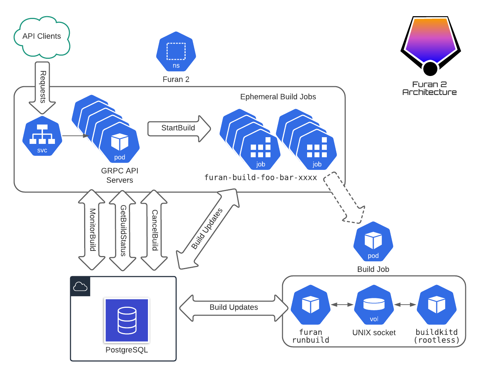

<h1 align="center">Furan 2</h1>

-----

<h4 align="center">Scale out Docker builds</h4>

-----

Furan 2 is a scalable, Kubernetes-native Docker build microservice (API) that builds and pushes Docker images from a specified GitHub repository to a specified image repository.

Furan supports [gRPC](https://grpc.io) and JSON clients, and runs builds asynchronously using [BuildKit](https://github.com/moby/buildkit) in single-shot, rootless
Kubernetes Jobs.

Furan supports pushing build artifacts to the following image repository services:

- [Quay.io](https://quay.io)
- [AWS ECR](https://aws.amazon.com/ecr/)

(Both public and private image repositories are supported.)

Essentially, Furan handles build requests like: 

*"Build the GitHub repo acme/foo at commit SHA xxx using the Dockerfile in the root, and push the result to the image repo at quay.io/acme/foo:tagname."*

Furan is a core part of the Dollar Shave Club software delivery pipeline and is used programmatically by services such as [Acyl](https://github.com/dollarshaveclub/acyl).

<h3>Architecture</h3>

Furan's only runtime dependencies are PostgreSQL and Kubernetes.

<h3>API</h3>

At a high level, the Furan API consists of the following RPCs:

1. StartBuild (asynchronously begin a build/push job)
2. MonitorBuild (streaming RPC, get a realtime stream of build messages for a running job)
3. GetBuildStatus (get the status of a running job)
4. ListBuilds (get a list of build jobs according to a set of criteria)
5. CancelBuild (abort an actively running job)

For more details, see the [protobuf definition](protos/api.proto).

<h3 align="center">&middot;&middot;&middot;</h3>